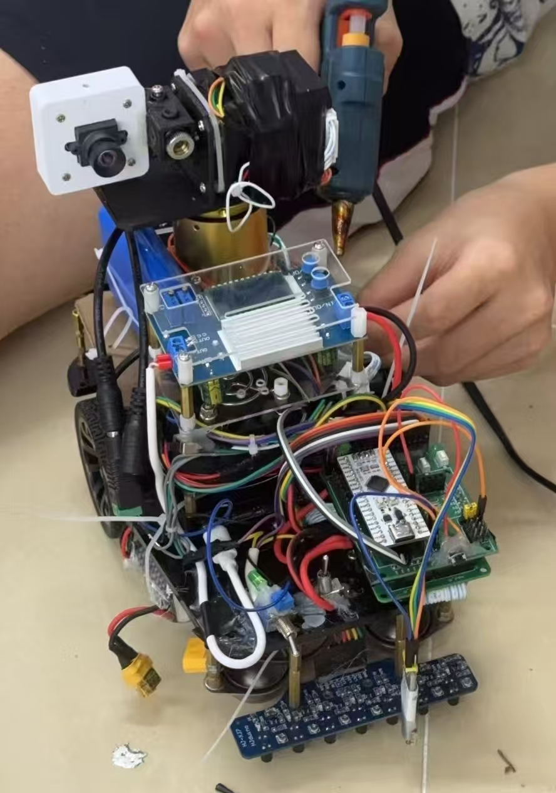

# 2025-NUEDC-E-Ti_CAR
## 2025年电赛E题自瞄寻迹小车控制端完赛代码

## 战车靓照

## 运行方法
1. 配置 keil + sysconfig 环境
2. 将工程放置路径：./Ti/M0_SDK/mspm0_sdk_2_03_00_07

## 思路
### 第1问：
整体使用寻迹环进行控制，当灰度传感器检测到拐角时，MCU切换成速度环差速转向同时使用编码器里程计数，减少转向误差；由于起始点自定，我们便设置找到4个拐角为1圈，并用按键设置圈数，最终实现小车行驶特定圈数的功能；
### 第2问/第3问：
由小电脑控制，MCU通过UART接收小电脑发送的云台的转动角度，进而控制云台转动。当目标未出现在相机视野时，MCU控制云台360度转动直到靶子出现在视野，再由小电脑进行图像处理，获取中心位置，最后控制云台转动至目标位置。